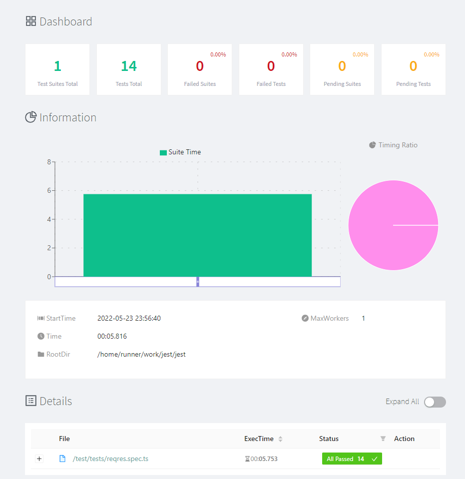

# Jest

A sample API test automation project in [TypeScript](https://www.typescriptlang.org/), using [Jest](https://jestjs.io/), [Axios](https://axios-http.com/docs/intro), and [jest-html-reporters](https://github.com/Hazyzh/jest-html-reporters#readme).

## ReqRes

The API chosen for testing was ReqRes. It simulates how a real application behaves, is highly available and accessible from anywhere. For more information, visit their website [here](https://reqres.in/).

## How it works

The project uses Jest as the test framework, Axios as the HTTP client to perform API requests, and jest-html-reporters to generate HTML reports.  
A workflow is set up to install Node.js, install the required packages, run the tests, and publish the HTML report to GitHub Pages. The report can be viewed [here](https://kafziel4.github.io/jest-api-tests/).

## How to run it

- Install [Node.js](https://nodejs.org/en/)
- Install the project packages: `npm install`
- Run the tests: `npm test`

